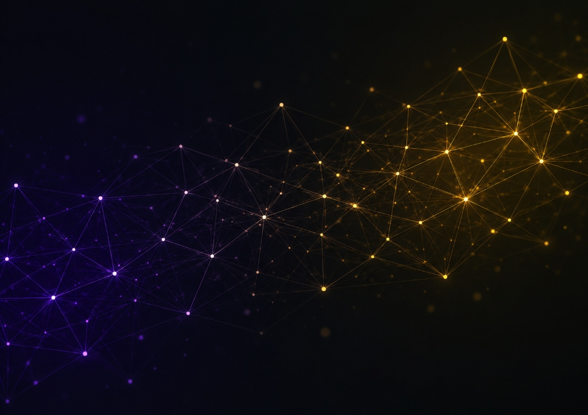

<div align="center">

# ✨ Shubhangi Katariyar
### Machine Learning Graduate Student & AI Engineer

[](https://in.linkedin.com/in/shubhangi-katariyar)
[](https://scholar.google.com/citations?user=07HQWI4AAAAJ&hl=en&oi=ao)
[](https://www.researchgate.net/profile/Shubhangi-Katariyar-2/research)
[](https://github.com/shubhangikatariyar)
[](https://x.com/shubhangikat)
[](mailto:katariyar.shubhangi@gmail.com)

<p align="center">
  
</p>

*Master's in Electrical and Computer Engineering (ML & Signal Processing) at **University of Wisconsin–Madison** with 4+ years of industry experience architecting scalable AI solutions, Agentic Systems, and Responsible AI frameworks.*

</div>

---

## 🧭 Table of Contents
- [About Me](#-about-me)
- [Featured Research & Publications](#-featured-research--publications)
- [Key Projects](#-key-projects)
- [Work Experience](#-work-experience)
- [Education](#-education)
- [Tech Stack](#-tech-stack)
- [Running This Portfolio Locally](#-running-this-portfolio-locally)
- [Connect With Me](#-connect-with-me)

---

## 👩‍💻 About Me

- 🎓 **Graduate Student** at the **University of Wisconsin–Madison** focusing on Machine Learning and Signal Processing.
- 💼 **4+ Years Industry Experience** building production-grade Generative AI platforms, Autonomous Agents, and Enterprise NLP solutions at **ReBIT** and **TCS**.
- 🔬 **Published Researcher** in IEEE and Springer on cancer prognostic machine learning and clinical decision-support systems.
- 🎯 **Core Interests**: Large Language Models (LLMs), Retrieval-Augmented Generation (RAG), Autonomous AI Agents, Responsible & Explainable AI (XAI), and MLOps.

---

## 🔬 Featured Research & Publications

| Title | Venue | Description | Link |
| :--- | :---: | :--- | :---: |
| **Survival Prediction of Renal Cell Carcinoma Patients using ML** | **IEEE** | Predicted survival outcomes for RCC patients combining clinical features and segmented CT scan tumor imaging. | [📄 IEEE Xplore](https://ieeexplore.ieee.org/document/10455029) |
| **ML Framework for Breast, Lung, and Liver Cancer Detection** | **Springer** | Integrated histopathological image analysis with survey & demographic data via optimized Gradient Boosting models. | [📖 Springer Link](https://link.springer.com/chapter/10.1007/978-981-95-3616-0_9) |

---

## 🚀 Key Projects

- **🎬 [Cine AI: Movie Recommendation System](https://github.com/shubhangikatariyar/Cine-AI-Movie-Recommendation-System)**  
  Content-based recommendation engine powered by NLP plot embeddings, deployed with Streamlit on Heroku.  
  *([▶️ Watch Demo](https://www.youtube.com/watch?v=F6STdcI0zDA))*

- **🤖 [Sahayak Bot: Vision-Guided Robotic Arm](https://github.com/shubhangikatariyar/Sahayak-Bot)**  
  Robotic arm system integrating computer vision for automated object detection and precision pick-and-place manipulation.  
  *([▶️ Watch Demo](https://www.youtube.com/watch?v=nRCZaozm6M4))*

- **🎮 [Hippi Hangry Game](https://github.com/shubhangikatariyar/HippiHangryGame)**  
  2D arcade physics game built in Unity (C#) featuring custom physics engines, event-driven scoring, and object pooling.  
  *([▶️ Watch Demo](https://www.youtube.com/shorts/TC2j8moP46k))*

- **⚡ [LED Chaser Using 8051 Microcontroller](https://github.com/shubhangikatariyar/LED-Chaser-Using-8051)**  
  Embedded hardware design demonstrating custom LED sequencing using the 8051 microcontroller architecture.

---

## 💼 Work Experience

### 🏛️ **Reserve Bank Information Technology (ReBIT)** — *Data Scientist*
`Nov 2025 – Jul 2026`
- **Enterprise GenAI Platform**: Built low-code Generative AI infrastructure enabling business units to deploy customized RAG repositories across enterprise documentation.
- **Advanced Retrieval Pipelines**: Engineered multi-stage chunking (entity-based, section-wise) boosting factual grounding and LLM retrieval relevance.
- **Agentic Conversational Chatbots**: Deployed autonomous agent workflows translating natural language queries into automated analytical operations.

### 🏢 **Tata Consultancy Services (TCS)** — *AI Engineer*
`Jun 2022 – Nov 2025`
- **Responsible AI Framework**: Spearheaded an ethical AI governance platform adopted company-wide for model auditing, bias detection, and compliance tracking.
- **MLOps & Automation**: Designed automated CI/CD pipelines covering intelligent ingestion, self-documenting training, and canary releases.
- **Explainability Engineering**: Created novel XAI tools combining global and local interpretation techniques to provide stakeholders with actionable model transparency.

### 🏢 **Tata Consultancy Services (TCS)** — *NLP Intern*
`Mar 2022 – May 2022`
- Designed transformer-based patent classification models leveraging USPTO datasets with interpretability pipelines.

---

## 🎓 Education

- **University of Wisconsin–Madison** (Aug 2026 – Dec 2027)  
  *Master of Science in Electrical and Computer Engineering* — Machine Learning & Signal Processing
- **University of Mumbai** (Aug 2018 – May 2022)  
  *Bachelor of Engineering in Electronics and Telecommunications*

---

## 🛠️ Tech Stack

<div align="left">

| Domain | Technologies & Frameworks |
| :--- | :--- |
| **AI / ML & GenAI** | `PyTorch` `TensorFlow` `Hugging Face Transformers` `LangChain` `RAG` `Scikit-Learn` `OpenCV` `Responsible AI / XAI` |
| **Languages** | `Python` `TypeScript` `JavaScript` `C++` `C#` `SQL` `HTML5` `CSS3` |
| **Frontend & Web** | `Next.js 15` `React 18` `Tailwind CSS` `Radix UI` `Shadcn/UI` `Streamlit` |
| **DevOps & Cloud** | `Docker` `Git` `GitHub Actions` `CI/CD` `Linux` `Firebase` `Heroku` |

</div>

---

## 💻 Running This Portfolio Locally

This portfolio is built with **Next.js 15**, **React**, and **Tailwind CSS**, featuring dynamic light/dark themes with custom neural constellation mesh backgrounds.

```bash
# 1. Clone the repository
git clone https://github.com/shubhangikatariyar/studio.git
cd studio

# 2. Install dependencies
npm install

# 3. Start development server
npm run dev

# 4. Open in browser
# Navigate to http://localhost:3000/studio
```

---

## 📫 Connect With Me

- 💼 **LinkedIn**: [linkedin.com/in/shubhangi-katariyar](https://in.linkedin.com/in/shubhangi-katariyar)
- 🎓 **Google Scholar**: [citations?user=07HQWI4AAAAJ](https://scholar.google.com/citations?user=07HQWI4AAAAJ&hl=en&oi=ao)
- 🔬 **ResearchGate**: [profile/Shubhangi-Katariyar-2](https://www.researchgate.net/profile/Shubhangi-Katariyar-2/research)
- 🐙 **GitHub**: [@shubhangikatariyar](https://github.com/shubhangikatariyar)
- 🐦 **Twitter/X**: [@shubhangikat](https://x.com/shubhangikat)
- 📧 **Email**: [katariyar.shubhangi@gmail.com](mailto:katariyar.shubhangi@gmail.com) / [katariyar@wisc.edu](mailto:katariyar@wisc.edu)

<div align="center">
  <sub>Built with ❤️ by Shubhangi Katariyar</sub>
</div>
